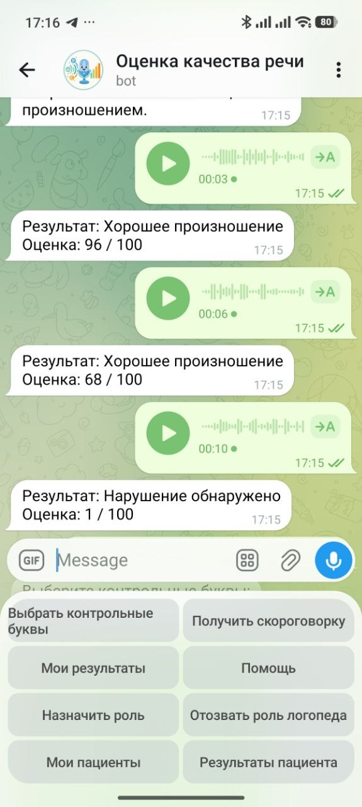
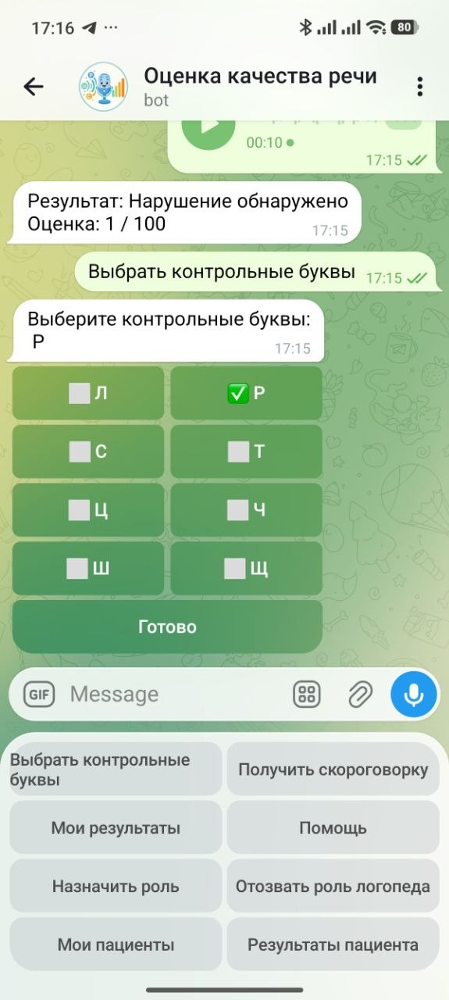
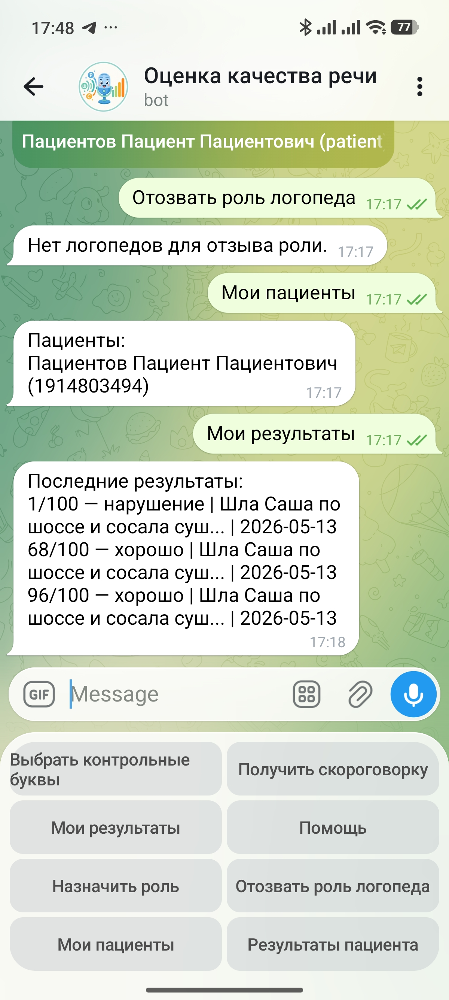

## Сервис детекции дефектов речи

Telegram-бот для логопедической диагностики. Пациент отправляет аудиозапись скороговорки, модель оценивает качество произношения по шкале 0–100.

### Архитектура

Два контейнера:
- **bot** — Telegram-бот, SQLite, управление пользователями и доступом (`db.py`, `keyboards.py`, `main.py`)
- **ml_api** — FastAPI-сервис инференса, модель Whisper-small с частичным дообучением

### Структура файлов

```
src/
├── bot/
│   ├── db.py           # БД, константы, вспомогательные функции
│   ├── keyboards.py    # константы кнопок и построители клавиатур
│   ├── main.py         # обработчики и запуск бота
│   ├── requirements.txt
│   └── Dockerfile
├── ml_api/
│   ├── main.py         # FastAPI-эндпоинты и инференс
│   ├── requirements.txt
│   └── Dockerfile
├── data/               # SQLite и аудиозаписи (создаётся автоматически)
├── docker-compose.yml
└── .env
```

### Быстрый запуск

1. Скопировать `.env.example` в `.env` и заполнить переменные.
2. Убедиться, что папка `../models/whisper_small_finetuned/` содержит `best_ckpt.pt` и `threshold.json`.
3. Скороговорки берутся из `../data/tongue_twisters.csv` автоматически при первом запуске.
4. Если  нет, то нужно сделать 
   ```
   dvc pull -r http_yandex
   ```
4. Запустить:
   ```
   docker compose up --build
   ```

### Переменные окружения (.env)

| Переменная   | Описание                              | Пример                  |
|--------------|---------------------------------------|-------------------------|
| `BOT_TOKEN`  | Токен Telegram-бота                   | `123456:ABC-DEF...`     |
| `ADMIN_IDS`  | Telegram ID администраторов через `,` | `123456789,987654321`   |
| `DEVICE`     | Устройство для инференса              | `cpu` или `cuda`        |

### Роли

| Роль            | Кто назначает          | Возможности                                                              |
|-----------------|------------------------|--------------------------------------------------------------------------|
| **Пациент**     | автоматически при /start | скороговорки, голосовые, свои результаты, управление доступом логопеда |
| **Логопед**     | администратор          | результаты пациентов, выдавших доступ                                   |
| **Администратор** | через `ADMIN_IDS`    | назначение и отзыв роли логопеда                                        |

### Команды бота

**Общие:**
- `/start` — главное меню и список команд
- `/set_name <ФИО>` — указать имя (обязательно при первом входе)
- `/set_letters л р ш` — выбрать контрольные буквы для подбора скороговорок
- `/get_twister` — получить скороговорку
- `/my_results` — последние 5 результатов

**Пациент:**
- `/grant_access <telegram_id>` — выдать доступ логопеду
- `/revoke_access <telegram_id>` — отозвать доступ

**Логопед / Администратор:**
- `/patients` — список пациентов с выданным доступом
- `/patient_results <telegram_id>` — результаты конкретного пациента

**Администратор:**
- `/set_role <telegram_id> <admin|therapist|patient>` — изменить роль пользователя

### ML API

`POST /score` — оценка произношения.

Параметры: 
- `audio` (WAV), 
- `twister_id`, 
- `letters` (JSON-массив флагов букв), 
- `duration`, 
- `n_speakers`.

Ответ: 
- `score` (0–100), 
- `label` (`good`/`bad`), 
- `proba`, 
- `threshold`, 
- `model_version`.

`GET /health` — проверка работоспособности.

### Примеры работы бота

Отправка голосовых сообщений и получение результата


Выбор контрольных букв


Просмотр результатов
